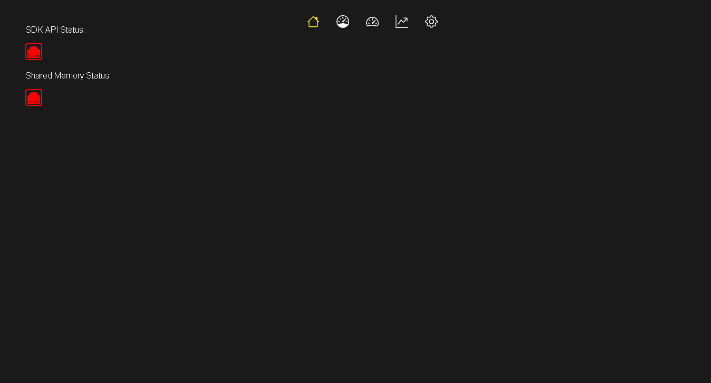
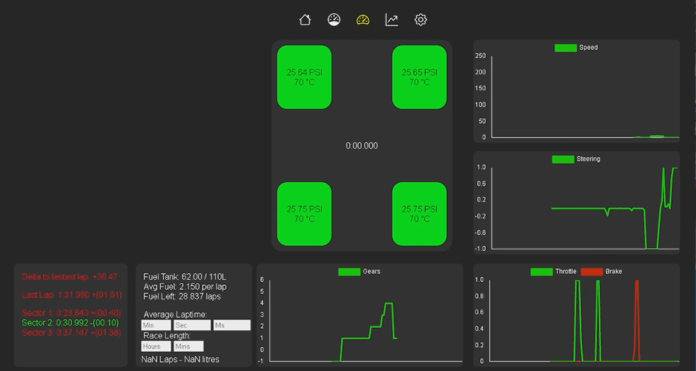
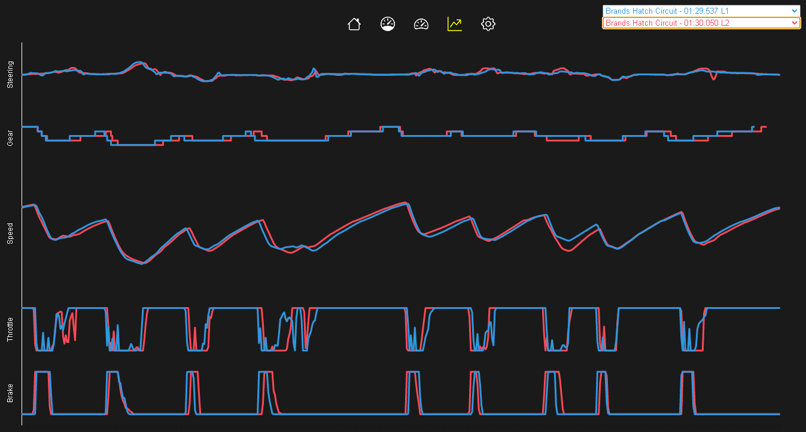
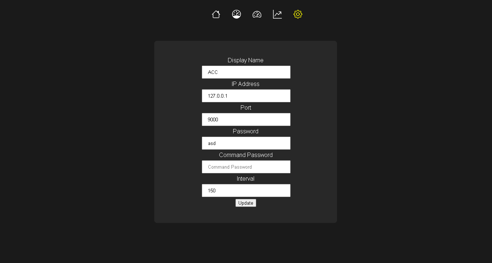

# ACC Telemetry Tool

ACC Telemetry Tool is an external tool aimed at  drivers who play [Assetto Corsa Competizione](https://assettocorsa.gg/assetto-corsa-competizione/) and are looking to improve their performance.

Installation
======

Make sure that you have the latest [NodeJS](https://nodejs.org/en) installed.

Install these following dependencies
```bash
npm install acc-node-wrapper
```
```bash
npm install chartjs
```
```bash
npm install sqlite3
```

Usage
====

In order to start the application type the following command
```bash
npm start
```

Screenshots
====
## Home Screen
Home screen indicating if the driver is connnected to the SDK API or Shared Memory.

* Connection **Red** - not connected to SDK/Shared Memory or Assetto Corsa Competizione is not launched.
* Connection **Green** - connected to SDK/Shared Memory and found Assetto Corsa Competizione.


## Telemetry Screen
Contains the following features:
* Tyre Temperature
* Pressure Gauge
* Speed, Steering, Throttle/Brake and Gears Telemetry
* Delta to the fastest session lap
* Fuel Calculation with the drivers average fuel per lap


## Comparison Screen
Comparison allows the driver to compare lap telemetry. The following telemetries can be compared are
* Speed
* Gear
* Speed
* Throttle
* Brake


## Settings Screen
The settings screen is used to configure the drivers configuration file to allow connecting to the ACC SDK and shared memory using [acc-node-wrapper](https://github.com/FynniX/acc-node-wrapper)

* 


Contributions
====

I would like to thanks [FynniX ACC-Node-Wrapper](https://github.com/FynniX/acc-node-wrapper) for providing with SDK and shared memory wrapper.

License
=====

[MIT](https://choosealicense.com/licenses/mit/)